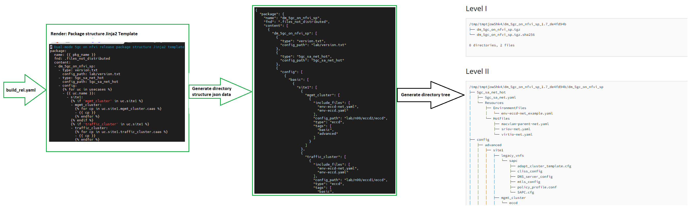

Dual-mode 5gc on NFVI support package release build guide
=========================================================

The contents on this page describe how to update build config yaml
file and how to use build script to create a support package for
release purpose




Build config yaml file
----------------------

The release support package directory structure is built according to the build config yaml configuration.
See inside comments of config file for how to release CCD, CNFs, VNFs configuration under 'cass:', 'cnfs:'
and 'sapc:' section.

---
**NOTE**

* Each config has 'tags' property which is matched to one OR more specific use cases,
if 'all' in tags, it means this config will be applied for all use cases.
* The section 'usecases' can not be empty.
* When only one usecase is defined in 'usecases', then there will decrease one directory level named with this usecase.
* If the config tags definition except 'all' is NOT included in section 'usecases',

---

Main sections:
* pkg_name
* usecases
* caas
* cnfs
* sapc
* build

Build script usage
------------------

The build script supports:

* Build a release support package
* Use option '--predelivery' to build a predelivery support package
* Remote build_rel.yaml will be used by default, the option '--local' to use local repo build_rel.yaml
* If only one usecase defined under `usecases` section, then there will no usecase path
* For formal release package, the tag name is `sp-<target solution version><SP release sub version>`
* For predelivery release package, the tag name is `sp-pre-<target solution version><SP release sub version>`

Build a release support package

```bash
py3venv
# build formal release package
python build/create_dist_pkg_v3.py --branch <BRANCH_NAME>

# build predelivery release package
python build/create_dist_pkg_v3.py --branch <BRANCH_NAME> --predelivery

# Example: build predelivery SP package without tagging
(csdp_python3_venv) seroiuts01648 [13:07] [eyanpho/tmp/5gc_sa_pkg] (release-1.10)-> python build/create_dist_pkg_v3.py --branch release-1.10 --no-tag --predelivery
INFO     > Cloning the repo using cmd: 'git clone https://eyanpho@gerrit.ericsson.se/a/5gc_config/5gc_sa_pkg /tmp/tmpfktndwex/dm_5gc_nfvi_repo' ..
INFO     > Checkout branch 'remotes/origin/release-1.10' using: git checkout --track remotes/origin/release-1.10
Branch 'release-1.10' set up to track remote branch 'release-1.10' from 'origin'.
INFO     > Running test cases via pytest ...
INFO     > All test cases are completed without issue
INFO     > Create release path dm-5gc-1.10-on-ericsson-nfvi-support-package_predelivery/readme.txt
INFO     > Create release path dm-5gc-1.10-on-ericsson-nfvi-support-package_predelivery/common/external-network-hot
INFO     > Create release path dm-5gc-1.10-on-ericsson-nfvi-support-package_predelivery/site1/infrastructure/mgmt-cluster
INFO     > Create release path dm-5gc-1.10-on-ericsson-nfvi-support-package_predelivery/site1/infrastructure/traffic-cluster
INFO     > Create release path dm-5gc-1.10-on-ericsson-nfvi-support-package_predelivery/site1/nf/traffic-cluster/pcc1
INFO     > Create release path dm-5gc-1.10-on-ericsson-nfvi-support-package_predelivery/site1/nf/traffic-cluster/pcc2
INFO     > Create release path dm-5gc-1.10-on-ericsson-nfvi-support-package_predelivery/site1/nf/traffic-cluster/pcg
INFO     > Create release path dm-5gc-1.10-on-ericsson-nfvi-support-package_predelivery/site1/nf/traffic-cluster/ccrc
INFO     > Create release path dm-5gc-1.10-on-ericsson-nfvi-support-package_predelivery/site1/nf/traffic-cluster/ccsm
INFO     > Create release path dm-5gc-1.10-on-ericsson-nfvi-support-package_predelivery/site1/nf/traffic-cluster/ccdm
INFO     > Create release path dm-5gc-1.10-on-ericsson-nfvi-support-package_predelivery/site1/nf/traffic-cluster/cces
INFO     > Create release path dm-5gc-1.10-on-ericsson-nfvi-support-package_predelivery/site1/nf/traffic-cluster/sc
INFO     > Create release path dm-5gc-1.10-on-ericsson-nfvi-support-package_predelivery/site1/sapc
INFO     > Create release path dm-5gc-1.10-on-ericsson-nfvi-support-package_predelivery/site1/supporting-function/mgmt-cluster/evnfm
INFO     > Create release path dm-5gc-1.10-on-ericsson-nfvi-support-package_predelivery/site1/supporting-function/traffic-cluster/eda
INFO     > Create release path dm-5gc-1.10-on-ericsson-nfvi-support-package_predelivery/site2/infrastructure/traffic-cluster
INFO     > Create release path dm-5gc-1.10-on-ericsson-nfvi-support-package_predelivery/site2/nf/traffic-cluster/pcc1
INFO     > Create release path dm-5gc-1.10-on-ericsson-nfvi-support-package_predelivery/site2/nf/traffic-cluster/pcc2
INFO     > Create release path dm-5gc-1.10-on-ericsson-nfvi-support-package_predelivery/site2/nf/traffic-cluster/ccrc
INFO     > Create release path dm-5gc-1.10-on-ericsson-nfvi-support-package_predelivery/site2/nf/traffic-cluster/ccsm
INFO     > Create release path dm-5gc-1.10-on-ericsson-nfvi-support-package_predelivery/site2/nf/traffic-cluster/ccdm
INFO     > Create release path dm-5gc-1.10-on-ericsson-nfvi-support-package_predelivery/upgrade-1.9-1.10/site1/infrastructure/mgmt-cluster/ts1.9-config
INFO     > Create release path dm-5gc-1.10-on-ericsson-nfvi-support-package_predelivery/upgrade-1.9-1.10/site1/infrastructure/traffic-cluster/ts1.9-config
INFO     > Create release path dm-5gc-1.10-on-ericsson-nfvi-support-package_predelivery/upgrade-1.9-1.10/site1/nf/traffic-cluster/pcc/ts1.9-config
INFO     > Create release path dm-5gc-1.10-on-ericsson-nfvi-support-package_predelivery/upgrade-1.9-1.10/site1/nf/traffic-cluster/pcg/ts1.9-config
INFO     > Create release path dm-5gc-1.10-on-ericsson-nfvi-support-package_predelivery/upgrade-1.9-1.10/site1/nf/traffic-cluster/ccrc/ts1.9-config
INFO     > Create release path dm-5gc-1.10-on-ericsson-nfvi-support-package_predelivery/upgrade-1.9-1.10/site1/nf/traffic-cluster/ccsm/ts1.9-config
INFO     > Create release path dm-5gc-1.10-on-ericsson-nfvi-support-package_predelivery/upgrade-1.9-1.10/site1/nf/traffic-cluster/ccdm/ts1.9-config
INFO     > Create release path dm-5gc-1.10-on-ericsson-nfvi-support-package_predelivery/upgrade-1.9-1.10/site1/nf/traffic-cluster/cces/ts1.9-config
INFO     > Create release path dm-5gc-1.10-on-ericsson-nfvi-support-package_predelivery/upgrade-1.9-1.10/site1/nf/traffic-cluster/sc/ts1.9-config
INFO     > Create release path dm-5gc-1.10-on-ericsson-nfvi-support-package_predelivery/upgrade-1.9-1.10/site1/supporting-function/mgmt-cluster/evnfm/ts1.9-config
INFO     > Create release path dm-5gc-1.10-on-ericsson-nfvi-support-package_predelivery/upgrade-1.9-1.10/site1/supporting-function/traffic-cluster/eda/ts1.9-config
INFO     > Creating the tarball dm-5gc-1.10-on-ericsson-nfvi-support-package_predelivery.tgz
INFO     > Generated dual-mode 5gc on nfvi SP tar file: dm-5gc-1.10-on-ericsson-nfvi-support-package_predelivery.tgz with commit id fe068816
INFO     > The sha256 checksum for dm-5gc-1.10-on-ericsson-nfvi-support-package_predelivery.tgz is b3a181d1ee7bd411621b14d25c73cd34b750169584c49b35e7b210f48f40a5a5

```

From Target Solution 1.9, the build script creates the tags for each released support package, check the tags with the following command, the listed tags which includes checksum matches to relase support package tgz file.
```bash
git tag -n5
git tag -l  --format='%(tag) |  %(subject)'
```
